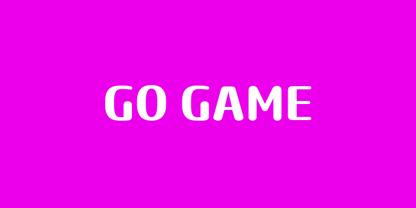
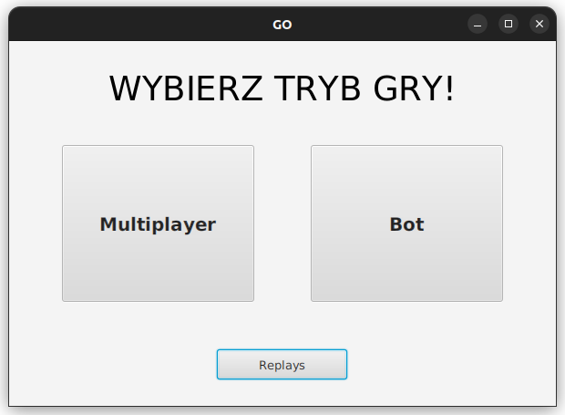
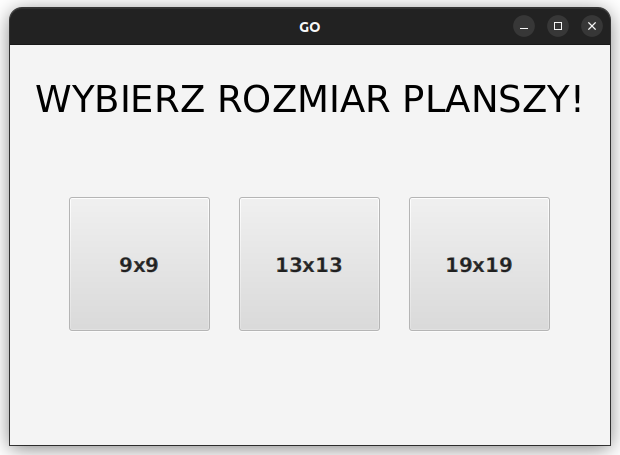
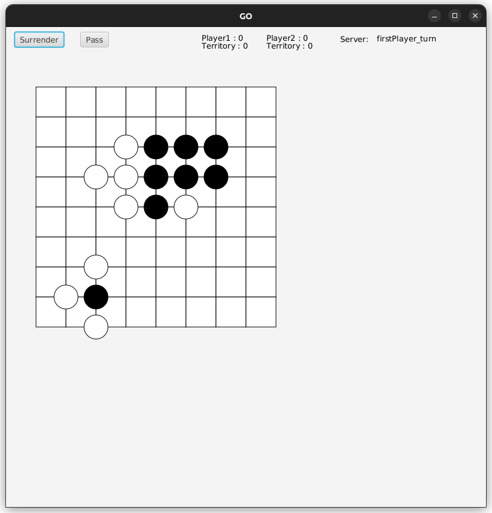
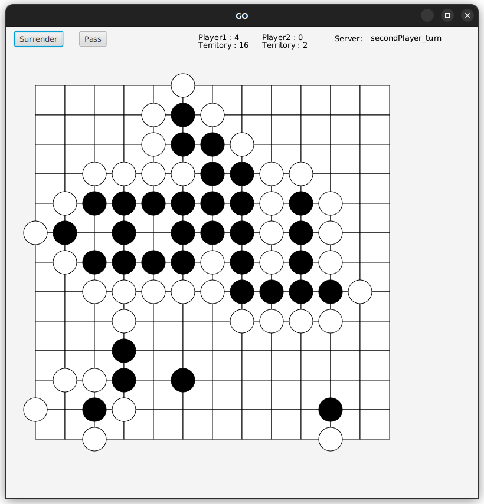

# GO GAME


## **GO game** to fascynująca gra strategiczna napisana w języku Java, inspirowana klasyczną grą planszową GO. Ta gra to pełnoprawna przygoda, która testuje twoje umiejętności logicznego myślenia i strategii. Oto kilka zdjęć z gameplay'a.





# **Uruchomienie**

Program korzysta z bazy MarieDB i łączy się za pomocą JDBC
Baza, z którą się łączy musi mieć nazwę go_games oraz
posiadać dwie tabele i użytkownika o nazwie server
i haśle GoGoPowerRanger

```bash
CREATE TABLE game (
    id INT AUTO_INCREMENT PRIMARY KEY,
    date_column DATETIME,
    index_gry INT,
    INDEX idx_date (date_column),
    INDEX idx_index_gry (index_gry)
);


CREATE TABLE board (
    id INT AUTO_INCREMENT PRIMARY KEY,
    index_gry INT,
    board VARCHAR(3000),
    INDEX idx_index_gry (index_gry),
    INDEX idx_board (board)
);

CREATE USER 'server'@'localhost' IDENTIFIED BY 'GoGoPowerRangers';
GRANT ALL PRIVILEGES ON *.* TO 'server'@'localhost' WITH GRANT OPTION;
FLUSH PRIVILEGES;

```

Uruchomeinie gry wymaga włączenie serwera w GO/server (wymaga Maven'a)
```bash
mvn clean install
mvn exec:java
```

Uruchomienie klienta - folder GO/gogo
```bash
mvn javafx:run
```
